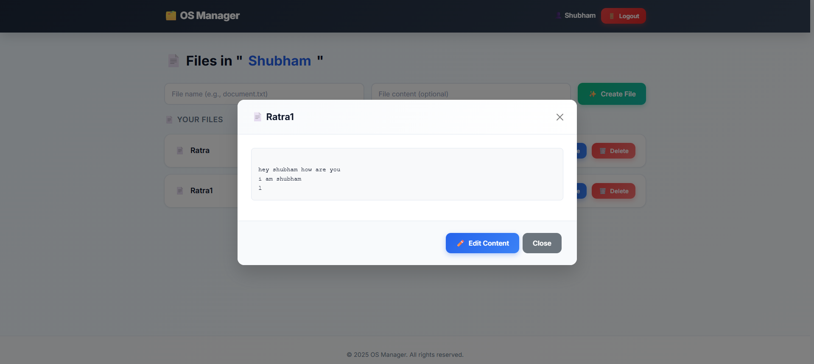

# 🗂️ Your OS Manager

A modern, secure, and production-ready web-based file and folder management system built with the MERN stack (MongoDB, Express.js, React-inspired frontend). This application allows authenticated users to create, organize, and manage folders and files through an intuitive and responsive web interface. Designed for scalability, security, and ease of use.

## ✨ Demo

![Your OS Manager Preview]
![Website screenshot]





## ✨ Features

- **🔐 Secure User Authentication**
  - JWT-based authentication with HTTP-only cookies
  - Password hashing with bcrypt
  - Strong password validation (uppercase, lowercase, numbers, special characters)
  - Session management with automatic logout

- **📁 Folder Management**
  - Create, rename, and delete folders
  - User-specific folder isolation
  - Prevent duplicate folder names per user

- **📄 File Management**
  - Create files with custom content
  - Rename and delete files
  - View file content directly in the browser
  - Update file content
  - Organize files within folders
  - Prevent duplicate file names within the same folder

- **🎨 Modern UI/UX**
  - Responsive design using Bootstrap 5
  - Clean, professional interface
  - Mobile-friendly layout
  - Smooth animations and transitions
  - Intuitive navigation between pages

- **⚡ Performance & Security**
  - Lightweight Express.js backend
  - MongoDB for scalable data storage
  - CORS configuration for secure API access
  - Input validation and error handling
  - Database indexing for optimal query performance

## 🚀 Quick Start

### Prerequisites

- **Node.js** (v16 or higher)
- **MongoDB** (local installation or cloud service like MongoDB Atlas)
- **npm** or **yarn**

### Installation

1. **Clone the repository:**
   ```bash
   git clone https://github.com/yourusername/your-os-manager.git
   cd your-os-manager
   ```

2. **Install dependencies:**
   ```bash
   npm install
   ```

3. **Set up environment variables:**
   Create a `.env` file in the root directory:
   ```env
   MONGO_URI=mongodb://localhost:27017/your-os-manager
   JWT_SECRET=your-super-secret-jwt-key-here
   PORT=1111
   NODE_ENV=development
   ```

   > **Security Note:** Never commit your `.env` file to version control. Use strong, unique secrets for production.

4. **Start MongoDB:**
   Ensure MongoDB is running locally or update `MONGO_URI` for your cloud instance.

5. **Run the application:**
   ```bash
   npm run dev
   ```

6. **Open your browser:**
   Navigate to `http://localhost:1111`

## 📖 Usage

1. **Sign Up/Login:** Create an account or log in with existing credentials.
2. **Dashboard:** Access your personalized file management interface.
3. **Folder Operations:** Create, rename, or delete folders from the folders page.
4. **File Operations:** Select a folder to manage files within it – create, edit, rename, or delete files.
5. **Content Management:** View and update file content directly in the browser.

## 🔧 API Reference

### Authentication Routes (`/auth`)

| Method | Endpoint  | Description       | Request Body                                                | Response               |
| ------ | --------- | ----------------- | ----------------------------------------------------------- | ---------------------- |
| POST   | `/signup` | Register new user | `{"name": "string","email": "string","password": "string"}` | User data + JWT cookie |
| POST   | `/login`  | User login        | `{"email": "string","password": "string"}`                  | User data + JWT cookie |
| POST   | `/logout` | User logout       | -          -             -                 -                | Clears JWT cookie      |
| GET    | `/me`     | Get current user  | -          -             -                 -                | Current user data      |

### Folder Routes (`/folder`) - *Requires Authentication*

| Method | Endpoint  | Description       | Request Body                                   | Response              |
| ------ | --------- | ----------------- | ---------------------------------------------- | --------------------- |
| POST   | `/create` | Create folder     | `{ "name": "string" }`                         | Success message       |
| POST   | `/rename` | Rename folder     | `{ "oldname": "string", "newname": "string" }` | Success message       |
| POST   | `/delete` | Delete folder     | `{ "name": "string" }`                         | Success message       |
| GET    | `/list`   | List user folders | -         -            -            -          | Array of folder names |

### File Routes (`/file`) - *Requires Authentication*

| Method | Endpoint   | Description    | Request Body/Query                                                 | Response            |
| ------ | ---------- | -------------- | ------------------------------------------------------------------ | ------------------- |
| POST   | `/create`  | Create file    | `{ "folder": "string", "name": "string", "details": "string" }`    | Success message     |
| POST   | `/rename`  | Rename file    | `{ "folder": "string", "oldname": "string", "newname": "string" }` | Success message     |
| POST   | `/delete`  | Delete file    | `{ "folder": "string", "name": "string" }`                         | Success message     |
| POST   | `/update`  | Update content | `{ "folder": "string", "name": "string", "details": "string" }`    | Success message     |
| GET    | `/list`    | List files     | Query: `?folder=folderName`                                        | Array of file names |
| GET    | `/content` | Get content    | Query: `?folder=folderName&name=fileName`                          | File content        |

## 🏗️ Project Structure

```
your-os-manager/
├── app.js                          # Main application entry point
├── package.json                    # Dependencies and scripts
├── .env                            # Environment variables (not committed)
├── .gitignore                      # Git ignore rules
├── controllers/                    # Business logic layer
│   ├── authController.js           # Authentication logic
│   ├── fileController.js           # File operations
│   └── folderController.js         # Folder operations
├── middleware/                     # Express middleware
│   └── authMiddleware.js           # JWT authentication middleware
├── models/                         # MongoDB schemas
│   ├── authModel.js                # User schema
│   ├── fileModel.js                # File schema
│   └── folderModel.js              # Folder schema
├── routes/                         # API route handlers
│   ├── authRoutes.js               # Authentication routes
│   ├── fileRoutes.js               # File management routes
│   └── folderRoutes.js             # Folder management routes
└── public/                         # Static frontend assets
    ├── index.html                  # Landing page
    ├── auth.html                   # Login/Signup page
    ├── folders.html                # Folder management UI
    ├── files.html                  # File management UI
    ├── css/
    │   └── style.css               # Custom styles
    └── images/                     # Screenshots and assets
        ├── signUp_page.png
        ├── home_page.png
        ├── folder_page.png
        ├── file_page.png
        └── content_page.png
```

## 🏛️ Architecture

This application follows the **MVC (Model-View-Controller)** pattern with a clear separation of concerns:

- **Models** (`models/`): Define data schemas and interact with MongoDB using Mongoose.
- **Views** (`public/`): HTML pages served statically, styled with Bootstrap and custom CSS.
- **Controllers** (`controllers/`): Handle business logic, validate inputs, and manage data operations.
- **Routes** (`routes/`): Define API endpoints and apply middleware like authentication.

### Data Flow

```
Client Request → Routes → Middleware (Auth) → Controllers → Models → MongoDB
                      ↓
                Response ← Controllers ← Models ← MongoDB
```

### Security Features

- **JWT Authentication:** Stateless authentication with secure, HTTP-only cookies.
- **Password Security:** Bcrypt hashing with salt rounds.
- **Input Validation:** Server-side validation for all user inputs.
- **CORS Protection:** Configured for specific origins in production.
- **User Isolation:** Database queries scoped to authenticated user IDs.

## 🛠️ Technologies Used

### Backend
- **Node.js** - Runtime environment
- **Express.js** - Web framework
- **MongoDB** - NoSQL database
- **Mongoose** - ODM for MongoDB
- **JWT** - JSON Web Tokens for authentication
- **bcrypt** - Password hashing
- **cookie-parser** - Cookie handling

### Frontend
- **HTML5** - Markup
- **CSS3** - Styling
- **Bootstrap 5** - UI framework
- **JavaScript (ES6+)** - Client-side logic

### Development Tools
- **Nodemon** - Development server with auto-restart
- **dotenv** - Environment variable management

## 🚀 Deployment

### Environment Setup
1. Set `NODE_ENV=production` in your `.env` file.
2. Update `MONGO_URI` to your production MongoDB instance.
3. Ensure `JWT_SECRET` is a strong, random string.
4. Configure CORS origin for your domain.

### Production Checklist
- [ ] Environment variables configured
- [ ] MongoDB connection tested
- [ ] HTTPS enabled (recommended)
- [ ] CORS origins restricted
- [ ] Rate limiting implemented (optional)
- [ ] Logging configured (optional)

### Example Deployment Commands
```bash
# Using PM2 (recommended for production)
npm install -g pm2
pm2 start app.js --name "your-os-manager"
pm2 startup
pm2 save
```

## 🤝 Contributing

We welcome contributions! Please follow these steps:

1. Fork the repository
2. Create a feature branch: `git checkout -b feature/amazing-feature`
3. Commit changes: `git commit -m 'Add amazing feature'`
4. Push to branch: `git push origin feature/amazing-feature`
5. Open a Pull Request

### Development Guidelines
- Follow ESLint configuration (if added)
- Write clear commit messages
- Test API endpoints thoroughly
- Update documentation for new features
- Ensure mobile responsiveness

## 📞 Support

If you encounter issues or have questions:
- Open an issue on GitHub
- Check the API documentation above
- Review the code comments for implementation details

## 🙏 Acknowledgments

- Built with ❤️ using Node.js, Express, and MongoDB
- UI inspired by modern web design principles
- Thanks to the open-source community for amazing tools

---

**Your OS Manager** - Professional file management made simple.
